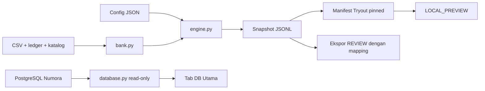

# Arsitektur dan integrasi

## Kepemilikan

Dua repo/deployment untuk dua VPS. Numora memiliki aplikasi, identitas canonical, lifecycle assessment, scoring, adopsi kandidat dan publikasi. Repo AI memiliki config/generator/kandidat lokal/alat inspeksi. IRT adalah arah integrasi; compute worker IRT belum ada dalam kode ini.

Kontrak Numora: [ADR compute terpisah](../../Numora/docs/adr/ADR-011-separated-irt-compute.md), [spesifikasi varian/IRT](../../Numora/docs/data/VARIANT_IRT_DATABASE.md). Link membutuhkan repo berdampingan. Migrasi/schema milik Numora; repo ini belum mengimplementasikan consumer, lease, outbox, sealed artifact atau writer `irt_compute` pada rancangan tersebut.

## Alur dan modul



| Modul dalam `variant_gen/` | Tanggung jawab |
|---|---|
| `bank.py` | CSV, ledger, katalog/metadata, loader workspace |
| `config_store.py` | Versi config, hash, schema |
| `randomizer.py`, `expr.py` | RNG per variabel; evaluator, aritmetika, render |
| `filters.py`, `engine.py` | Filter/validator; pipeline kandidat dan snapshot |
| `store.py` | Append-only JSONL, versi/seed/history |
| `lint.py` | Reproduksi original dan probe in-memory |
| `tryout.py` | Paket, validasi manifest, pinning, preview export |
| `handoff.py` | Envelope Numora dengan canonical mapping |
| `cli.py` | Orchestration, immutability config, duplicate inventory |
| `webui.py`, `webui.html` | HTTP localhost dan UI operator |
| `database.py` | Pembacaan PostgreSQL terpisah dari generator |

Workspace default memuat bank dasar indikator 16–19, bank tambahan 6–10,11–15,20–23, dan Tryout 1: 670 original, 575 config, 94 kelompok katalog termasuk level kosong. `--bank` custom tetap standalone. Bank lokal tidak otomatis diimpor dari database utama.

## Penyimpanan dan versi

Original seed 0 dari CSV+ledger, tidak di-append ke store. Varian memiliki ID `<question_id>:s<seed>:v<variant_ver>`. Config version, original version dan variant version berbeda; regen menambah variant version, menautkan `replacement_of` dan alasan.

Snapshot memuat `record_id`, `question_id`, `seed`, `variant_ver`, `config_ver`, `config_hash`, `original_hash`, `original_version`, `draws_used`, `values_used`, `stem`, `options[{id,text}]`, `key`, `explanation`, `format`, `cognitive_level`, `replacement_of`, `regen_reason`, `created_at`; klasifikasi/metadata bila tersedia. `key`: ID benar dipisah koma, KATEGORI angka, PG/MCMA huruf. KATEGORI dengan label khusus juga menyimpan `answer_categories`. Snapshot historis dapat tidak memiliki pembahasan/klasifikasi terbaru.

Hash original/config adalah fingerprint SHA-256 dipotong 16 karakter; guard identitas lokal, bukan tanda tangan authenticity. Original hash tidak mencakup klasifikasi. Perubahan config/catalog tidak menulis ulang snapshot. Pecahan metadata dapat menjadi float JSON; preview/export memakai teks/kunci snapshot.

Store default `variant_gen/store/variants.jsonl`; manifest UI `variant_gen/store/packages/`. Backup bank+ledger+catalog+metadata, seluruh versi config, JSONL dan manifest terkait. Manifest sendiri belum cukup: pinned variant harus ada dalam store. Satu writer; JSONL dibaca ulang, belum memakai indeks DB.

## Ekspor ke Numora

`package-export` menghasilkan **LOCAL_PREVIEW**: validasi struktur, roster/status/original konseptual terhadap bank; bukan bukti authenticity setiap varian. `generate_package` juga mencocokkan pinned variant dengan snapshot store. Ekspor paket tidak membuat canonical mapping.

Ekspor **individual** memakai stored snapshot dan mapping dari pemilik ID Numora:

```powershell
python -B variant_gen/cli.py export tryout-1-b1-q01 s5 v1 --mapping mapping.json --store scratch/variants.jsonl
```

Mapping satu objek JSON, bukan dictionary per question:

| Field | Sumber/validasi |
|---|---|
| `questionExternalId` | Sama `question_id` snapshot |
| `originalHash`, `originalVersion` | Sama identitas original snapshot |
| `familyId` | UUID canonical keluarga dari Numora |
| `parentQuestionVersionId` | UUID versi original canonical yang dipin |
| `scoringRubricVersionId` | UUID versi rubric |
| `generationWaveItemId` | UUID opsional dari Numora |

UUID non-zero; generator tidak membuat/mencari ID. Pemeriksaan offline tidak membuktikan existence/relasi UUID; importer Numora wajib memvalidasi DB, original/rubric. Mapping historis harus cocok snapshot historis, bukan sekadar bank aktif.

Envelope: `questionExternalId`, `variantExternalId`, `payload`, `answer`, `explanation`, `generation` dengan `reviewStatus=REVIEW`. PG satu ID benar; MCMA list ID benar; KATEGORI truth value **seluruh** pernyataan termasuk false. Snapshot tanpa pembahasan lengkap ditolak. Ekspor kanonik menerima satu label kognitif C1–C6 dan kategori boolean Benar/Salah; label kognitif gabungan atau kategori khusus tetap lokal sampai mapping semantiknya disahkan. Command tidak insert/upload/adopt/publish.

## Browser database

Membaca `public.assessment_packages`, `public.package_items`, `public.question_versions`, `public.question_variants`. Paket menampilkan versi dari `package_items.question_version_id`, bukan selalu latest. Keluarga menunjukkan original/varian/history. Paket DRAFT/demo/kosong mengikuti hak akun; pagination dapat menelusuri seluruh hasil.

`DATABASE_URL` dari environment/.env root. Koneksi read-only, repeatable-read; timeout connect/query lima detik; TLS remote. Tidak membuat role/grant/view/schema. Browser menerima data/error tersanitasi, bukan kredensial. Markup/media/JSON ditampilkan sebagai teks; tidak mengeksekusi HTML atau render media/LaTeX aktif. Mutasi DB ditolak.

API operator localhost: GET `/api/questions`, `/api/catalog`, `/api/question`; POST `/api/generate`, `/api/regen`, `/api/lint`, `/api/config`, `/api/tryout/generate-package`. Route DB GET `/api/database/status`, `/api/database/packages`, `/api/database/package`, `/api/database/family`. Host/origin lokal divalidasi; belum kontrak service-to-service produksi.

## Belum diimplementasikan

- Generator 10 Drill/3 Tryout konseptual; bank Pretest; 80 original Drill level 4–5.
- Registry kapasitas finite exact dan fallback reuse saat stok habis.
- Import/write/sinkronisasi kandidat Numora, paket canonical dan publikasi.
- Compute/kalibrasi IRT, adjuster config otomatis, exposure/scoring siswa.
- Worker deployment, autentikasi API produksi, queue, writer paralel/transaksi JSONL.

Max_draws membatasi pencarian; generator/lint tidak menetapkan validitas akademik, kesetaraan kesulitan atau kesiapan publikasi.
