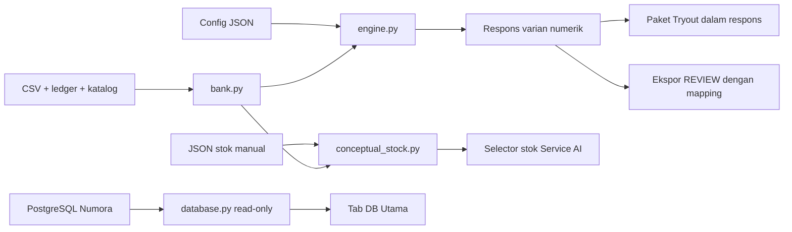

# Arsitektur dan integrasi

## Kepemilikan

Dua repo/deployment untuk dua VPS. Numora memiliki aplikasi, identitas canonical, lifecycle assessment, scoring, adopsi kandidat dan publikasi. Repo AI memiliki config/generator/kandidat lokal/alat inspeksi. IRT adalah arah integrasi; compute worker IRT belum ada dalam kode ini.

Kontrak Numora: [ADR compute terpisah](../../Numora/docs/adr/ADR-011-separated-irt-compute.md), [spesifikasi varian/IRT](../../Numora/docs/data/VARIANT_IRT_DATABASE.md). Link membutuhkan repo berdampingan. Migrasi/schema milik Numora; repo ini belum mengimplementasikan consumer, lease, outbox, sealed artifact atau writer `irt_compute` pada rancangan tersebut.

## Alur dan modul



| Modul dalam `variant_gen/` | Tanggung jawab |
|---|---|
| `bank.py` | CSV, ledger, katalog/metadata, loader workspace |
| `config_store.py` | Versi config, hash, schema |
| `randomizer.py`, `expr.py` | RNG per variabel; evaluator, aritmetika, render |
| `filters.py`, `engine.py` | Filter/validator; pipeline kandidat dan respons |
| `store.py` | Error validasi respons/ekspor; tanpa penyimpanan |
| `conceptual_stock.py` | Pembaca/validator stok manual VERIFIED; provenance, maksimum empat, tanpa penulisan |
| `lint.py` | Reproduksi original dan probe in-memory |
| `tryout.py` | Paket dalam respons, validasi manifest |
| `handoff.py` | Envelope Numora dengan canonical mapping |
| `cli.py` | Orchestration generate/preview/ekspor tanpa cache |
| `webui.py`, `webui.html` | HTTP localhost dan UI operator |
| `database.py` | Pembacaan PostgreSQL terpisah dari generator |

Workspace default memuat bank dasar indikator 16–19, bank tambahan1–2,3–5,6–10,11–15,20–23, dan Tryout 1: 820 original,673 config,109 kelompok katalog termasuk level kosong. `--bank` custom tetap standalone. Bank lokal tidak otomatis diimpor dari database utama.

## Respons dan versi

Original/config tetap berbasis file. Generator numerik tidak menyimpan varian, manifest, atau riwayat; tidak mengakses DB. GET `/api/question` pada soal numerik memuat original/config dengan `variant: null`; POST `/api/generate` mengembalikan hasil langsung. POST `/api/tryout/generate-package` mengembalikan seluruh paket dalam satu respons.

Stok konseptual adalah asset offline `data/conceptual_stock.json`: 67 original Drill dengan 206 varian VERIFIED. GET `/api/questions` memberi `stock_count` dan `variant_mode`; GET `/api/question?id=...&stock_variant=N` membaca stok pilihan (default1), bukan menjalankan generator. Respons memakai `source_kind: conceptual_stock`, `stock_index`, `variant_id`, versi stok, hash/versi original dan kategori sumber; seed/config null. Tidak ada pencatatan penggunaan atau endpoint tulis stok. Hash/versi source usang, item invalid dan indeks tidak tersedia ditolak; DRAFT tidak dilayani. Server memuat asset saat startup, sehingga perubahan memerlukan restart.

`same_answer_as_original` dikecualikan hanya untuk stok; validator numerik tetap ketat. Review variasi/kesulitan menilai tugas aktual, bukan hanya label kognitif: [audit lengkap](audits/2026-10-06-conceptual-stock-audit.md). Kesetaraan IRT belum diukur.

Respons mempertahankan bentuk record existing: ID `<question_id>:s<seed>:v1`, seed, versi/hash config dan original, variabel, stem, opsi, key, pembahasan, klasifikasi, dan waktu pembuatan. `variant_ver` selalu 1; `replacement_of`/`regen_reason` null. ID tersebut bukan identitas unik setiap panggilan; service utama harus menentukan identitas record DB jika menyimpan beberapa respons identik.

Seed/config sama menghasilkan konten sama. Tidak ada deduplikasi terhadap panggilan sebelumnya atau penghentian karena stok terpakai. Validasi terhadap original dan batas draw tetap berlaku. Hash original menormalkan CRLF menjadi LF agar checkout Windows/Linux tidak mengubah identitas isi soal.

Backup hanya diperlukan untuk sumber, ledger, katalog/metadata, serta config. Tampilan halaman menyimpan hasil sementara dalam memori browser, tanpa localStorage/sessionStorage atau unduh paket.

## Ekspor ke Numora

Paket respons berstatus **LOCAL_PREVIEW**; validasi struktur, roster, status, dan original konseptual memakai bank. Tidak membuat file atau canonical mapping.

Ekspor **individual** menghitung respons baru dengan seed/config terbaru dan mapping dari pemilik ID Numora:

```powershell
python -B variant_gen/cli.py export tryout-1-b1-q01 s5 --mapping mapping.json
```

Mapping satu objek JSON, bukan dictionary per question:

| Field | Sumber/validasi |
|---|---|
| `questionExternalId` | Sama `question_id` respons |
| `originalHash`, `originalVersion` | Sama identitas original respons |
| `familyId` | UUID canonical keluarga dari Numora |
| `parentQuestionVersionId` | UUID versi original canonical yang dipin |
| `scoringRubricVersionId` | UUID versi rubric |
| `generationWaveItemId` | UUID opsional dari Numora |

UUID non-zero; generator tidak membuat/mencari ID. Pemeriksaan offline tidak membuktikan existence/relasi UUID; importer Numora wajib memvalidasi DB, original/rubric. Mapping harus cocok versi/hash original pada respons.

Envelope: `questionExternalId`, `variantExternalId`, `payload`, `answer`, `explanation`, `generation` dengan `reviewStatus=REVIEW`. PG satu ID benar; MCMA list ID benar; KATEGORI truth value **seluruh** pernyataan termasuk false. Snapshot tanpa pembahasan lengkap ditolak. Ekspor kanonik menerima satu label kognitif C1–C6 dan kategori boolean Benar/Salah; label kognitif gabungan atau kategori khusus tetap lokal sampai mapping semantiknya disahkan. Command tidak insert/upload/adopt/publish.

## Browser database

Membaca `public.assessment_packages`, `public.package_items`, `public.question_versions`, `public.question_variants`. Paket menampilkan versi dari `package_items.question_version_id`, bukan selalu latest. Keluarga menunjukkan original/varian/history. Paket DRAFT/demo/kosong mengikuti hak akun; pagination dapat menelusuri seluruh hasil.

`DATABASE_URL` dari environment/.env root. Koneksi read-only, repeatable-read; timeout connect/query lima detik; TLS remote. Tidak membuat role/grant/view/schema. Browser menerima data/error tersanitasi, bukan kredensial. Markup/media/JSON ditampilkan sebagai teks; tidak mengeksekusi HTML atau render media/LaTeX aktif. Mutasi DB ditolak.

API operator localhost: GET `/api/questions`, `/api/catalog`, `/api/question`; POST `/api/generate`, `/api/lint`, `/api/config`, `/api/tryout/generate-package`. Route DB GET `/api/database/status`, `/api/database/packages`, `/api/database/package`, `/api/database/family`. Host/origin lokal divalidasi; belum kontrak service-to-service produksi.

## Belum diimplementasikan

- Generator untuk soal konseptual tidak dibuat; 67 original Drill memakai stok manual. Tiga Tryout konseptual belum berstok; 77 Drill review sumber belum terlayani. Bank Pretest dan 80 original Drill level4–5 belum tersedia.
- Registry kapasitas exact generator numerik belum tersedia. Stok manual memiliki jumlah pasti dan dapat dibaca ulang tanpa habis; tidak memerlukan fallback penggunaan ulang.
- Import/write/sinkronisasi kandidat Numora, paket canonical dan publikasi.
- Compute/kalibrasi IRT, adjuster config otomatis, exposure/scoring siswa.
- Worker deployment, autentikasi API produksi, queue, writer paralel/transaksi JSONL.

Max_draws membatasi pencarian; generator/lint tidak menetapkan validitas akademik, kesetaraan kesulitan atau kesiapan publikasi.
